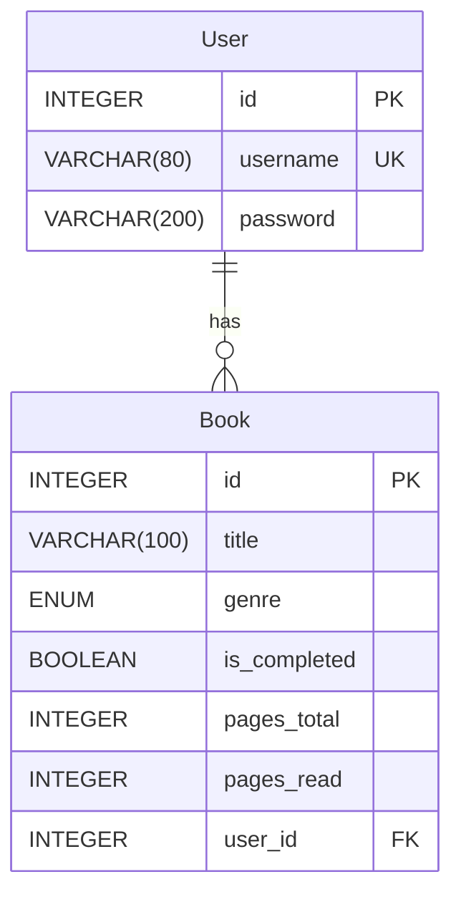

# Book Progress Tracker - Technical Architecture Documentation

## 1. Database Schema

The application utilizes a relational database (SQLite by default) to store user and book information. The schema consists of two main tables: `User` and `Book`.

### 1.1. Tables and Columns

#### `User` Table

Stores information about registered users.

| Column Name | Data Type | Description                               | Constraints        |
| :---------- | :-------- | :---------------------------------------- | :----------------- |
| `id`        | INTEGER   | Primary key, unique identifier for the user | PRIMARY KEY, AUTOINCREMENT |
| `username`  | VARCHAR(80) | Unique username for login                 | UNIQUE, NOT NULL   |
| `password`  | VARCHAR(200)| Hashed password for user authentication   | NOT NULL           |

#### `Book` Table

Stores details about each book tracked by users.

| Column Name      | Data Type   | Description                                   | Constraints        |
| :--------------- | :---------- | :-------------------------------------------- | :----------------- |
| `id`             | INTEGER     | Primary key, unique identifier for the book   | PRIMARY KEY, AUTOINCREMENT |
| `title`          | VARCHAR(100)| Title of the book                             | NOT NULL           |
| `genre`          | ENUM        | Genre of the book (e.g., Fiction, Fantasy)    | NOT NULL           |
| `is_completed`   | BOOLEAN     | Indicates if the book is fully read           | DEFAULT FALSE      |
| `pages_total`    | INTEGER     | Total number of pages in the book             | NOT NULL           |
| `pages_read`     | INTEGER     | Number of pages read by the user              | DEFAULT 0          |
| `user_id`        | INTEGER     | Foreign key linking to the `User` table       | NOT NULL, FOREIGN KEY (`User.id`) |

### 1.2. Entity-Relationship (ER) Diagram

## 2. Class/Module Breakdown (Backend)

The backend is structured into several Python modules, each responsible for specific functionalities.

### `app.py`

The main Flask application entry point.
- **Purpose:** Initializes the Flask app, configures extensions (SQLAlchemy, Marshmallow, Bcrypt, JWTManager, CORS, Flasgger), registers blueprints, and defines global routes.
- **Key Functions/Components:**
    - `app = Flask(__name__)`: Flask application instance.
    - `CORS(app)`: Enables Cross-Origin Resource Sharing.
    - `db.init_app(app)`, `ma.init_app(app)`, `bcrypt.init_app(app)`, `JWTManager(app)`: Initializes Flask extensions.
    - `app.register_blueprint(...)`: Registers `auth_bp` and `books_bp`.
    - `@app.route('/ping')`: A simple health check endpoint.
    - `swagger = Swagger(app, template=swagger_template)`: Initializes Flasgger for API documentation.

### `backend/__init__.py`

Initializes database and serialization extensions.
- **Purpose:** To create instances of `SQLAlchemy` and `Marshmallow` that can be imported and used across different modules, preventing circular imports and ensuring proper initialization with the Flask app.
- **Key Components:**
    - `db = SQLAlchemy()`: Database instance.
    - `ma = Marshmallow()`: Marshmallow instance for serialization.

### `backend/auth.py`

Handles user authentication and authorization logic.
- **Purpose:** Provides routes for user registration, login, and username availability checks.
- **Key Functions/Components:**
    - `auth_bp = Blueprint('auth', __name__)`: Flask Blueprint for authentication routes.
    - `bcrypt = Bcrypt()`: Bcrypt instance for password hashing.
    - `@auth_bp.route('/register', methods=['POST'])`: Handles new user registration, including password strength validation.
    - `@auth_bp.route('/login', methods=['POST'])`: Handles user login and JWT token generation.
    - `@auth_bp.route('/check-username', methods=['GET'])`: Checks if a given username is already registered.

### `backend/books.py`

Manages CRUD operations for books.
- **Purpose:** Provides API endpoints for creating, retrieving, updating, and deleting book records.
- **Key Functions/Components:**
    - `books_bp = Blueprint('books', __name__)`: Flask Blueprint for book-related routes.
    - `book_schema`, `books_schema`: Marshmallow schemas for single and multiple book serialization/deserialization.
    - `@books_bp.route('/books', methods=['POST'])`: Creates a new book. Requires JWT authentication.
    - `@books_bp.route('/books', methods=['GET'])`: Retrieves a list of books with filtering, sorting, and pagination. Requires JWT authentication.
    - `@books_bp.route('/books/<int:book_id>', methods=['GET'])`: Retrieves details of a specific book. Requires JWT authentication.
    - `@books_bp.route('/books/<int:book_id>', methods=['PUT'])`: Updates an existing book. Requires JWT authentication.
    - `@books_bp.route('/books/<int:book_id>', methods=['DELETE'])`: Deletes a book. Requires JWT authentication.

### `backend/db_commands.py`

Custom Flask CLI commands for database management.
- **Purpose:** Provides a command-line interface for database initialization.
- **Key Functions/Components:**
    - `@click.command('init-db')`: Defines the `flask init-db` command.
    - `init_db_command()`: Function to create all database tables.

### `backend/models.py`

Defines the database models.
- **Purpose:** Defines the structure of the `User` and `Book` tables using SQLAlchemy ORM.
- **Key Classes:**
    - `Genre(enum.Enum)`: Python Enum for book genres.
    - `Book(db.Model)`: SQLAlchemy model for books, including a `progress_percent` property.
    - `User(db.Model)`: SQLAlchemy model for users.

### `backend/schemas.py`

Defines Marshmallow schemas for data serialization/deserialization.
- **Purpose:** Converts SQLAlchemy model instances to/from Python dictionaries (JSON) for API communication.
- **Key Classes:**
    - `BookSchema(ma.SQLAlchemyAutoSchema)`: Schema for `Book` model, including `progress_percent` as dump-only and `genre` by value.
    - `UserSchema(ma.SQLAlchemyAutoSchema)`: Schema for `User` model, with `password` as load-only.

### `migrate_add_user_id.py`

A standalone script for database migration.
- **Purpose:** Adds the `user_id` column to the `Book` table and assigns existing books to a default user (if any) for backward compatibility. This is a one-time migration script.
- **Key Functions:**
    - `migrate_database()`: Contains the logic for altering the table and updating records.

## 3. Technical Documentation

### 3.1. Technology Stack

The Book Progress Tracker is built using a modern full-stack architecture.

-   **Frontend:**
    -   **React:** JavaScript library for building the user interface.
    -   **React Router DOM:** For client-side routing.
    -   **Axios:** HTTP client for making API requests.
    -   **React Toastify:** For displaying user notifications.
    -   **Custom CSS/Inline Styles:** For styling and responsive design.

-   **Backend:**
    -   **Flask:** Python micro-framework for the RESTful API.
    -   **Flask-SQLAlchemy:** ORM for interacting with the database.
    -   **Marshmallow & Marshmallow-SQLAlchemy:** For data serialization and validation.
    -   **Flask-Bcrypt:** For secure password hashing.
    -   **Flask-JWT-Extended:** For JSON Web Token (JWT) based authentication and authorization.
    -   **Flasgger:** For generating interactive Swagger/OpenAPI documentation.
    -   **python-dotenv:** For managing environment variables.

-   **Database:**
    -   **SQLite:** Lightweight, file-based relational database (default for development). Can be easily swapped for PostgreSQL, MySQL, etc., with SQLAlchemy.

### 3.2. High-Level Request/Response Flow

1.  **Frontend Action:** A user interacts with the React frontend (e.g., clicks a button, submits a form).
2.  **API Request:** The React application (using Axios) sends an HTTP request (GET, POST, PUT, DELETE) to the Flask backend API.
    *   For authenticated requests, a JWT token is included in the `Authorization: Bearer <token>` header.
3.  **Backend Routing:** The Flask application receives the request and routes it to the appropriate view function based on the URL and HTTP method.
4.  **Authentication/Authorization (if applicable):**
    *   If the route is protected by `@jwt_required()`, Flask-JWT-Extended validates the JWT token. If invalid or missing, a 401 Unauthorized response is returned.
    *   The `get_jwt_identity()` function retrieves the user ID from the token, which is then used to ensure the user is only accessing/modifying their own data (authorization).
5.  **Business Logic & Database Interaction:**
    *   The view function executes the relevant business logic (e.g., validates input data using Marshmallow schemas, performs calculations).
    *   It interacts with the database (using SQLAlchemy ORM) to query, insert, update, or delete data.
6.  **Data Serialization:** Database objects are converted into Python dictionaries (JSON) using Marshmallow schemas.
7.  **API Response:** The Flask backend sends an HTTP response (JSON data, status code) back to the frontend.
8.  **Frontend Update:** The React application receives the response, processes the data, and updates the UI accordingly (e.g., displays new data, shows a success/error message).

### 3.3. Authentication and Authorization

The system uses JWT (JSON Web Token) for authentication and authorization.

-   **Registration:**
    -   Users provide a username and password.
    -   The password is hashed using Bcrypt before being stored in the database.
    -   Password strength is validated on both frontend (real-time feedback) and backend (server-side enforcement).
    -   Username availability is checked in real-time on the frontend via a dedicated backend endpoint.
-   **Login:**
    -   Users provide their username and password.
    -   The provided password is compared with the stored hash using Bcrypt.
    -   If credentials are valid, a JWT access token is generated and returned to the frontend.
-   **Authorization:**
    -   The frontend stores the JWT token (e.g., in local storage).
    -   For protected routes, the frontend includes this token in the `Authorization` header as `Bearer <token>`.
    -   The `@jwt_required()` decorator on backend routes automatically validates the token.
    -   The `get_jwt_identity()` function retrieves the authenticated user's ID from the token, enabling row-level security (users can only access/modify their own books).

### 3.4. Overview of REST API Endpoints

The API follows RESTful principles, providing clear endpoints for resource manipulation. Full details, including request/response examples and schemas, are available via the Swagger UI.

-   **Authentication Endpoints (`/auth` blueprint):**
    -   `POST /auth/register`: Registers a new user.
    -   `POST /auth/login`: Authenticates a user and returns a JWT access token.
    -   `GET /auth/check-username?username=<username>`: Checks if a username is available.

-   **Book Management Endpoints (`/api` blueprint):**
    -   `POST /api/books`: Creates a new book record for the authenticated user.
    -   `GET /api/books`: Retrieves a paginated list of books for the authenticated user, with options for filtering by genre, searching by title, and sorting.
    -   `GET /api/books/<int:book_id>`: Retrieves details of a specific book by ID for the authenticated user.
    -   `PUT /api/books/<int:book_id>`: Updates an existing book record for the authenticated user.
    -   `DELETE /api/books/<int:book_id>`: Deletes a book record for the authenticated user.

### 3.5. Important Business Logic and Algorithms

-   **Password Hashing:** `Flask-Bcrypt` is used to securely hash and verify user passwords, preventing plaintext storage.
-   **Password Strength Validation:** During registration, passwords must meet criteria (minimum length, uppercase, lowercase, number, special character) enforced by regular expressions on both frontend and backend.
-   **Username Availability Check:** A dedicated endpoint and frontend logic provide real-time feedback on username uniqueness, improving user experience.
-   **Book Progress Calculation:** The `progress_percent` property in the `Book` model dynamically calculates the reading progress based on `pages_read` and `pages_total`.
-   **`is_completed` Logic:** The `is_completed` status is automatically managed on the frontend:
    -   If `pages_read` equals `pages_total`, `is_completed` is set to `true`.
    -   If the user manually checks `is_completed`, `pages_read` is automatically set to `pages_total`.
-   **Pagination, Filtering, and Sorting:** The `get_books` endpoint in the backend efficiently handles these operations using SQLAlchemy's query capabilities and Flask's request arguments. The frontend dynamically constructs queries and manages pagination state.
-   **Ownership Verification:** All book-related CRUD operations on the backend (`books.py`) include checks (`filter_by(user_id=current_user_id)`) to ensure that users can only access or modify books that belong to them, enforcing authorization.